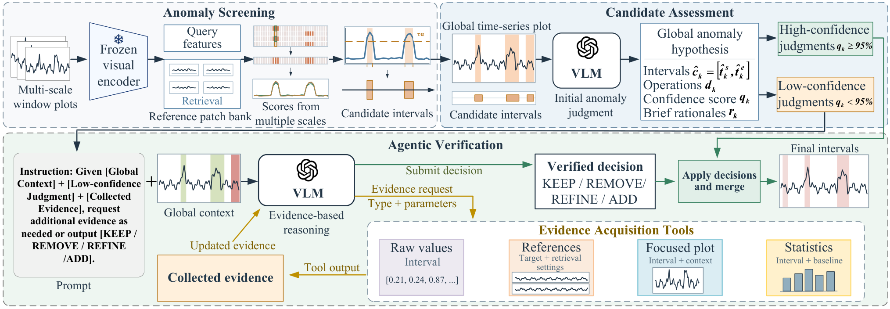
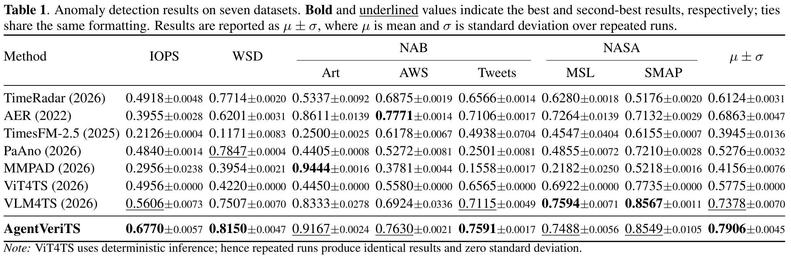
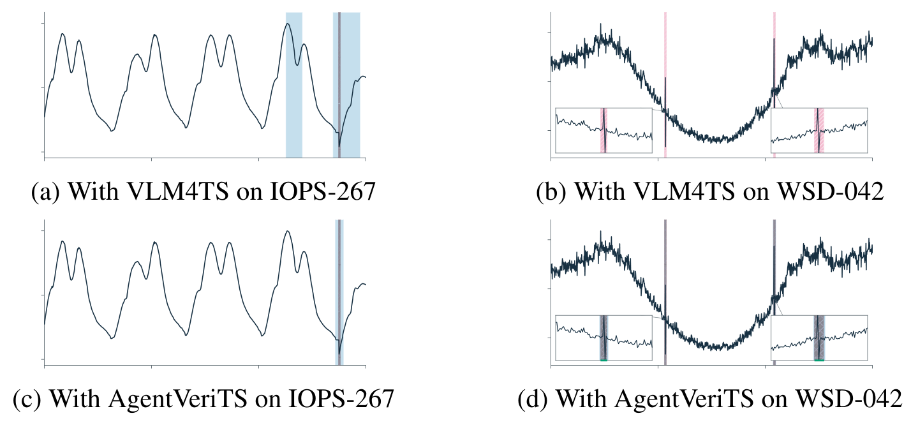

<h1 align="center">AgentVeriTS</h1>

<p align="center">
  <strong>Confidence-Guided Agentic Verification<br>for Time-Series Anomaly Detection</strong>
</p>

<p align="center">
  Screen candidate anomalies · Assess them in global context · Verify uncertain decisions with evidence
</p>

<p align="center">
  <a href="https://github.com/victoria-miking/AgentVeriTS/actions/workflows/contract-tests.yml"></a>
  
  
</p>

<p align="center">
  <a href="#overview">Overview</a> ·
  <a href="#main-results">Main results</a> ·
  <a href="#qualitative-comparison">Case studies</a> ·
  <a href="#datasets">Datasets</a> ·
  <a href="#quick-start">Quick start</a> ·
  <a href="#documentation">Documentation</a>
</p>

AgentVeriTS detects anomalies in **univariate time series** by combining visual screening, global candidate assessment, and selective agentic verification. When a judgment remains uncertain, the agent chooses evidence tools to inspect raw values, focused plots, historical references, or statistical deviations before confirming or revising the anomaly interval.

| Average F1 | Improvement over the strongest baseline | Dataset-level ranking |
| :---: | :---: | :---: |
| **0.7906 ± 0.0045** | **+7.16%** relative to VLM4TS | **3 best · 4 second-best** |

*Highlights from the paper: seven datasets and seven comparison methods.*

## Overview

[](docs/assets/mechanism-overview.png)

*Figure 1 from the paper. Click the figure to inspect the full-resolution image.*

| Module | What it does | Output |
| :--- | :--- | :--- |
| **Anomaly Screening** | A frozen visual encoder compares multi-scale time-series windows with a retrieved reference patch bank. | Candidate anomaly intervals |
| **Candidate Assessment** | A VLM jointly evaluates the candidates in the full-series view and can identify missed anomalies. | Global hypotheses with an operation, confidence, and rationale |
| **Agentic Verification** | The agent acquires additional evidence for judgments with confidence **q < 0.95**, while retaining the shared global context. | Verified decisions merged with high-confidence decisions |

The four interval operations are **KEEP**, **REMOVE**, **REFINE**, and **ADD**. Judgments with **q ≥ 0.95** retain their operation and bypass verification. Confidence is in **[0, 1]** and describes support for the chosen operation, including removal; it is not a calibrated probability. The threshold is configurable.

During verification, the agent can request `raw`, `focus`, `reference`, and `statistics` evidence and add missed anomalies. Decisions remain connected within one signal through the official Responses API and `previous_response_id`. See the [method and implementation contract](docs/PIPELINE.md) for details.

## Main results

**F1 ↑ on seven datasets**, transcribed from Table 1 of the paper. **Bold** marks the best result; <ins>underlining</ins> marks the second-best. The compact table shows means; the original table below includes all standard deviations.

| Method | IOPS | WSD | Art | AWS | Tweets | MSL | SMAP | Average |
| :--- | ---: | ---: | ---: | ---: | ---: | ---: | ---: | ---: |
| TimeRadar | 0.4918 | 0.7714 | 0.5337 | 0.6875 | 0.6566 | 0.6280 | 0.5176 | 0.6124 |
| AER | 0.3955 | 0.6201 | 0.8611 | **0.7771** | 0.7106 | 0.7264 | 0.7132 | 0.6863 |
| TimesFM-2.5 | 0.2126 | 0.1171 | 0.2500 | 0.6178 | 0.4938 | 0.4547 | 0.6155 | 0.3945 |
| PaAno | 0.4840 | <ins>0.7847</ins> | 0.4405 | 0.5272 | 0.2501 | 0.4855 | 0.7210 | 0.5276 |
| MMPAD | 0.2956 | 0.3954 | **0.9444** | 0.3781 | 0.1558 | 0.2182 | 0.5218 | 0.4156 |
| ViT4TS | 0.4956 | 0.4220 | 0.4450 | 0.5580 | 0.6565 | 0.6922 | 0.7735 | 0.5775 |
| VLM4TS | <ins>0.5606</ins> | 0.7507 | 0.8333 | 0.6924 | <ins>0.7115</ins> | **0.7594** | **0.8567** | <ins>0.7378</ins> |
| **AgentVeriTS** | **0.6770** | **0.8150** | <ins>0.9167</ins> | <ins>0.7630</ins> | **0.7591** | <ins>0.7488</ins> | <ins>0.8549</ins> | **0.7906** |

IOPS and WSD are from TSB-AD; Art, AWS, and Tweets are from NAB; MSL and SMAP are from NASA. AgentVeriTS ranks first on IOPS, WSD, and Tweets, and second on the other four datasets. Its average F1 increases from **0.7378 to 0.7906**, a **7.16% relative improvement** over VLM4TS.

<details>
<summary><strong>View the original Table 1 with mean ± standard deviation</strong></summary>

[](docs/assets/main-results.png)

Results are reported as **μ ± σ** over repeated runs. ViT4TS uses deterministic inference and has zero standard deviation. Click the table to read it at full resolution.

</details>

<details>
<summary><strong>Ablation study — contribution of each module</strong></summary>

Table 2 from the paper. NAB and NASA columns contain the paper's source-group aggregates; the Average column is reproduced as reported.

| Variant | IOPS | WSD | NAB | NASA | Average |
| :--- | ---: | ---: | ---: | ---: | ---: |
| w/o Candidate Assessment | 0.4313 | 0.5093 | 0.4829 | 0.5498 | 0.4984 |
| w/o Agentic Verification | 0.6619 | 0.6879 | 0.7865 | 0.7973 | 0.7577 |
| Anomaly Screening Only | 0.6561 | 0.7892 | 0.7223 | 0.7831 | 0.7398 |
| **AgentVeriTS** | **0.6770** | **0.8150** | **0.8129** | **0.8018** | **0.7906** |

The full method improves on screening alone and on the variant without evidence verification. Removing joint candidate assessment and using independent candidate-wise reasoning substantially reduces performance.

</details>

<details>
<summary><strong>Inference efficiency — runtime and detection quality</strong></summary>

Table 3 from the paper, measured in the reported Windows / RTX 5090 setup with the same GPT-5.6-sol backend for both methods.

| Method | Screening (s) ↓ | LLM/VLM (s) ↓ | Total (s) ↓ | F1 ↑ |
| :--- | ---: | ---: | ---: | ---: |
| VLM4TS | 42.65 | **2.57** | 45.22 | 0.7378 |
| **AgentVeriTS** | **23.86** | 13.72 | **37.58** | **0.7906** |

The paper reports **16.9% lower total runtime** alongside the improvement in average F1. These timings are tied to the paper's experimental setup.

</details>

*All results and timings above are reported manuscript measurements. They have not been remeasured on the current public code revision; see the [implementation audit](docs/MIGRATION_20260924.md) for validation scope.*

## Qualitative comparison

[](docs/assets/qualitative-comparison.png)

*Figure 3 from the paper. Top: VLM4TS. Bottom: AgentVeriTS. Red indicates ground truth, blue indicates detected intervals, and grey indicates detected hits.*

- **IOPS-267:** suppresses a false alarm at a normal periodic transition and refines an overly broad anomaly interval.
- **WSD-042:** recovers two short spikes that are difficult to distinguish in the global trend by inspecting focused local evidence.

## Datasets

**Download the data locally; this repository does not redistribute datasets.** IOPS and WSD use the **TSB-AD** release. For the other five datasets, follow the dataset naming and download route in [VLM4TS](https://github.com/ZLHe0/VLM4TS).

| Paper name | Source | Download selection | Signal type |
| :--- | :--- | :--- | :--- |
| **IOPS** | [TSB-AD](https://github.com/thedatumorg/TSB-AD/blob/main/Datasets/README.md) | IOPS files in `TSB-AD-U` | Operational KPI series |
| **WSD** | [TSB-AD](https://github.com/thedatumorg/TSB-AD/blob/main/Datasets/README.md) | WSD files in `TSB-AD-U` | Web-service metrics |
| **Art** | [NAB](https://github.com/numenta/NAB) via VLM4TS / Orion | `artificialWithAnomaly` | Synthetic anomaly patterns |
| **AWS** | [NAB](https://github.com/numenta/NAB) via VLM4TS / Orion | `realAWSCloudwatch` | Cloud infrastructure metrics |
| **Tweets** | [NAB](https://github.com/numenta/NAB) via VLM4TS / Orion | `realTweets` | Company-related tweet volumes |
| **MSL** | [NASA / Telemanom](https://github.com/khundman/telemanom) via VLM4TS / Orion | `MSL` | Mars Science Laboratory telemetry |
| **SMAP** | [NASA / Telemanom](https://github.com/khundman/telemanom) via VLM4TS / Orion | `SMAP` | Soil Moisture Active Passive telemetry |

Keep downloads under `data/raw/` and converted files under `data/processed/`; `data/` is ignored by Git. Each input CSV must have a header and one signal, preferably named `value`, with an optional `timestamp` column. Ground-truth labels are used only for external evaluation.

**[Dataset preparation guide →](docs/DATASETS.md)** — download commands, local paths, CSV examples, TSB-AD conversion, and label alignment.

## Quick start

Use **Python 3.10+** and install a PyTorch/torchvision build suitable for your device. From the repository root:

```bash
pip install -r requirements.txt
pip install -e .
```

Set an official OpenAI API key:

```bash
export OPENAI_API_KEY="your-api-key"
```

For Windows PowerShell, use `$env:OPENAI_API_KEY="your-api-key"`.

Prepare a CSV using the [dataset guide](docs/DATASETS.md), then replace `path/to/series.csv` with its local path. The file should contain a `value` column and an optional `timestamp` column:

```bash
agentverits --input path/to/series.csv \
  --config configs/agentverits_default.yaml \
  --output-dir outputs/example
```

The first screening run downloads pretrained OpenCLIP weights. The default API model is `gpt-5.6-sol`; model access depends on your account. Final intervals are written to `result.json`, alongside screening results, global hypotheses, evidence images, and API audit records. Intervals use **zero-based, inclusive endpoints**.

For CSV aliases, Python usage, threshold selection, output details, and tests, see the [usage guide](docs/USAGE.md).

## Documentation

| Resource | Contents |
| :--- | :--- |
| [Usage guide](docs/USAGE.md) | Installation, CLI and Python examples, input format, outputs, and tests |
| [Dataset preparation](docs/DATASETS.md) | Dataset sources, download commands, local layout, CSV format, and labels |
| [Method and implementation](docs/PIPELINE.md) | Paper-to-code mapping, scoring, confidence routing, and evidence tools |
| [Official API integration](docs/OPENAI_API.md) | Response continuity, structured outputs, retries, and failure handling |
| [Default configuration](configs/agentverits_default.yaml) | Screening scales, confidence threshold, model, and tool budgets |
| [Implementation audit](docs/MIGRATION_20260924.md) | Correctness fixes, retained details, compatibility, and validation scope |
| [Figure sources](docs/assets/README.md) | Provenance of the manuscript figures and table reproduced here |

---

<p align="center"><a href="#agentverits">Back to top ↑</a></p>
